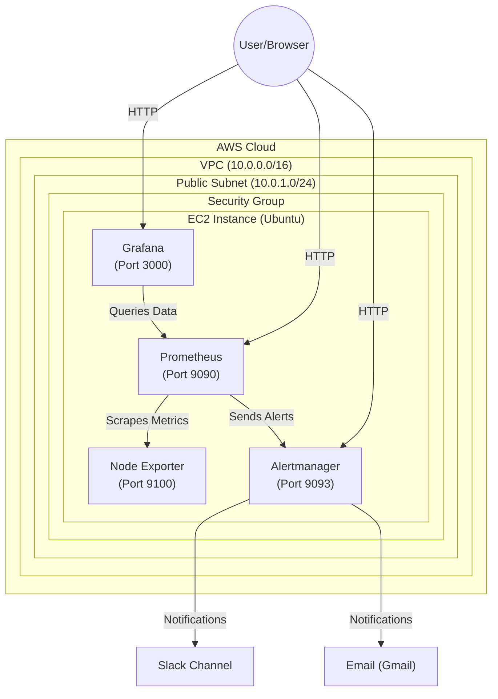

# AWS Prometheus & Grafana Monitoring

A comprehensive monitoring stack deployed on AWS using Prometheus for metrics collection, Grafana for visualization, and Alertmanager for notifications (Slack/Email).

## 🏗 Architecture
*   **Infrastructure:** AWS EC2 (t3.medium), VPC, Security Groups.
*   **Metrics Collection:** Prometheus (Scraping `node_exporter` targets).
*   **Visualization:** Grafana (Dashboards for System Health).
*   **Alerting:** Alertmanager (Routing alerts to Slack Channel & Email).



## 🚀 Components
*   **Prometheus (v2.45.0):** Time-series database.
*   **Grafana:** Metrics visualization platform.
*   **Alertmanager:** Handles alert deduplication, grouping, and routing.
*   **Node Exporter:** Exposes hardware and OS metrics.

## 🛠 Prerequisites
*   AWS CLI installed and configured.
*   Git Bash or WSL (for running scripts on Windows).
*   SSH Key Pair (`us-east1.pem`).

## 📥 Installation

### 1. Provision Infrastructure
Run the provisioning script to create VPC, Security Groups, and EC2 Instance.
```bash
cd scripts
./provision-aws-infrastructure.sh
```

### 2. Install Services
SSH into the provisioned instance and run the installation scripts.
```bash
# Upload scripts and config
scp -i "keys/us-east1.pem" scripts/*.sh config/*.yml ubuntu@<PublicIP>:~

# SSH into instance
ssh -i "keys/us-east1.pem" ubuntu@<PublicIP>

# Run Installers
chmod +x *.sh
./install-prometheus.sh
./install-node-exporter.sh
./install-alertmanager.sh
./install-grafana.sh
```

### 3. Configure Alerts
Update `config/alertmanager.yml` with your SMTP and Slack Webhook details, then apply:
```bash
sudo mv ~/alertmanager.yml /etc/alertmanager/alertmanager.yml
sudo systemctl restart alertmanager
```

## 📊 Access Dshboards

| Service | URL | Default Creds |
| :--- | :--- | :--- |
| **Prometheus** | `http://<PublicIP>:9090` | N/A |
| **Grafana** | `http://<PublicIP>:3000` | `admin` / `admin` |
| **Alertmanager** | `http://<PublicIP>:9093` | N/A |

## 🚨 Alerts Configured
*   **InstanceDown:** Triggers when an instance is down for > 1 minute.
*   **HostHighCpuLoad:** Triggers when CPU usage > 80% for 2 minutes.
*   **HostHighMemoryUsage:** Triggers when Memory usage > 90% for 2 minutes.
*   **HostOutOfDiskSpace:** Triggers when Disk usage > 90% for 2 minutes.
